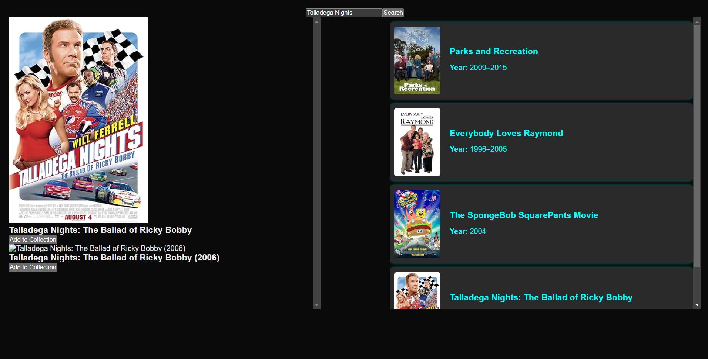

This is a [Next.js](https://nextjs.org) project bootstrapped with [`create-next-app`](https://nextjs.org/docs/app/api-reference/cli/create-next-app).

The app aims to make a management interface to lookup metadata for movies and shows in my personal collection. It uses the [OMDB API](https://www.omdbapi.com/#usage) to lookup the information about the media and then stores the information in the firebase firestore setup for the project. From here, once all of the metadata is stored for my collection I can connect the a rag-ai agent to answer questions/queries about the movies in my collection.

First Look at development:


## Getting Started

First, run the development server:

```bash
npm run dev
# or
yarn dev
# or
pnpm dev
# or
bun dev
```

Open [http://localhost:3000](http://localhost:3000) with your browser to see the result.

### Development Urls

- Admin Page => [http://localhost:3000/admin](http://localhost:3000/admin)
- Dashboard Page => [http://localhost:3000/dashboard](http://localhost:3000/dashboard)
- Dashboard Media Page => [http://localhost:3000/dashboard/media](http://localhost:3000/dashboard/media)
- Media Info Page => [http://localhost:3000/dashboard/media/info](http://localhost:3000/dashboard/media/info)

### Development - Getting Started

You can start editing the page by modifying `app/page.tsx`. The page auto-updates as you edit the file.

### Fonts

This project uses [`next/font`](https://nextjs.org/docs/app/building-your-application/optimizing/fonts) to automatically optimize and load [Geist](https://vercel.com/font), a new font family for Vercel.


