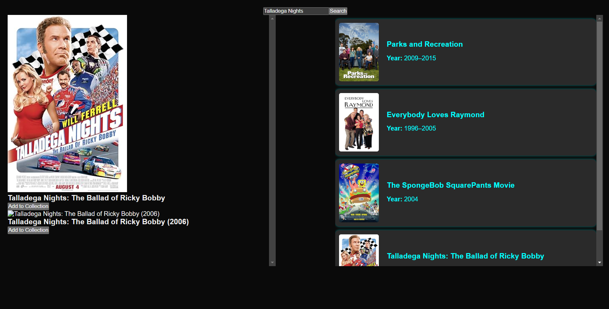

A self-hosted media library manager for personal use on a local mini PC.

The app provides a management interface to look up metadata for movies and shows, organise library files into a Jellyfin-compatible folder structure, and track physical media (Blu-ray discs, releases). It uses the [OMDB API](https://www.omdbapi.com/#usage) and [TMDB API](https://www.themoviedb.org/documentation/api) for metadata and stores everything in a locally-hosted **PostgreSQL** database — no cloud dependencies at runtime.

First Look at development:


## Stack

| Layer | Technology |
|---|---|
| Frontend | Next.js (App Router, TypeScript) |
| Backend | Python FastAPI (async, SQLAlchemy) |
| Database | PostgreSQL 16 |
| Auth | HTTP-only session cookie + bcrypt passphrase |
| Container | Docker + Docker Compose |

---

## Cataloguing Your Physical Collection

If you're logging a real collection of discs/tapes (not just testing), the
short version: catalogue items from your phone via the
[media-manager-mobile](https://github.com/colinmarley/media-manager-mobile)
companion app while sorting — no need to be at this machine — then rip them
here later at `/admin/disc-ripper` or `/admin/tape-ingest`, linking each rip
back to its pre-catalogued entry so rip-status stays trackable. See
[docs/guides/COLLECTION_CATALOGUING_WORKFLOW.md](docs/guides/COLLECTION_CATALOGUING_WORKFLOW.md)
for the full step-by-step walkthrough across both apps.

---

## Getting Started

### Prerequisites

- Node.js 18+
- Python 3.11+
- Docker (for the database)
- `make` (optional but recommended)

### 1. Clone and install dependencies

```bash
# Frontend
npm install

# Backend
cd backend
python3 -m venv venv
source venv/bin/activate      # Windows: venv\Scripts\activate
pip install -r requirements-dev.txt
cd ..
```

### 2. Configure environment variables

```bash
cp .env.example .env.local          # frontend
cp backend/.env.example backend/.env  # backend
```

Edit both files and fill in your API keys (OMDB, TMDB) and a strong `SESSION_SECRET_KEY`.

### OMDb API key locations

Update your OMDb key in these places depending on which side of the app is using it:

- Backend: [backend/.env](backend/.env) using `MEDIA_LIBRARY_OMDB_API_KEY`
- Frontend: [.env.local](.env.local) using `NEXT_PUBLIC_OMDB_API_KEY`
- Example template: [backend/.env.example](backend/.env.example)

### OMDb request limits

- Free OMDb API key: **1,000 requests/day**
- Paid $1/month OMDb subscription key: **100,000 requests/day**

If you change either key, restart the affected service so the new environment variable is loaded.

### 2.1 Linux NAS Mount Example (/ark)

If you use the TrueNAS SMB layout from this repo's defaults, mount shares under `/ark` and use `/ark/media/jellyfin` as destination:

```bash
sudo apt install -y cifs-utils
sudo mkdir -p /ark/{media,backups,documents,images,projects,staging,vaults}

# credentials file
sudo mkdir -p /etc/samba
sudo tee /etc/samba/truenas-credentials >/dev/null <<'EOF'
username=YOUR_TRUENAS_USER
password=YOUR_TRUENAS_PASSWORD
domain=WORKGROUP
EOF
sudo chmod 600 /etc/samba/truenas-credentials

# one-time mount test
sudo mount -t cifs //192.168.0.175/media /ark/media \
   -o credentials=/etc/samba/truenas-credentials,uid=$(id -u),gid=$(id -g),vers=3.0

# ensure destination folder exists
sudo mkdir -p /ark/media/jellyfin
```

Backend environment values for this layout:

```dotenv
JELLYFIN_DEST_BASE=/ark/media/jellyfin
MEDIA_LIBRARY_NAS_MOUNT_CHECK_PATH=/ark/media
MEDIA_LIBRARY_INGRESS_DEFAULT_PATHS=["/ark/media/ingest"]
```

### 3. Start the development database

The dev database runs on **port 5432** and its data persists across restarts.

```bash
make dev-db
# or: docker compose up postgres -d
```

### 4. Set the app password (first time only)

```bash
cd backend
source venv/bin/activate
python scripts/seed_password.py
```

### 5. Run the backend

```bash
cd backend
source venv/bin/activate
uvicorn main:app --reload --host 0.0.0.0 --port 8082
```

API docs: [http://localhost:8082/docs](http://localhost:8082/docs)

### 6. Run the frontend

```bash
npm run dev
```

Open [http://localhost:3000](http://localhost:3000) in your browser.

### App URLs

| Page | URL |
|---|---|
| Home | http://localhost:3000 |
| Admin | http://localhost:3000/admin |
| Library Browser | http://localhost:3000/admin/libraryBrowser |
| Media Assignment | http://localhost:3000/admin/libraryBrowser/assignment |
| Dashboard | http://localhost:3000/dashboard |
| API Docs | http://localhost:8082/docs |

---

## Production (Docker)

The full production stack (backend + database) is defined in `docker-compose.yml` and started with:

```bash
make docker-up
# or: docker compose up -d
```

```bash
make docker-down
# or: docker compose down
```

**The production database is only ever used when the stack is running via Docker.** Running tests or the backend locally can never touch production data — see [Testing](#testing) below.

---

## Testing

This project uses three fully isolated environments. Tests and local development never share data, and the production database is only reachable through Docker.

```
Environment │ Database            │ Port │ Started by
────────────┼─────────────────────┼──────┼──────────────────
test        │ media_manager_test  │ 5433 │ make test-*
dev         │ media_manager       │ 5432 │ make dev-db
production  │ media_manager       │ 5432 │ make docker-up
```

### Run all unit tests (no database required)

```bash
make test
```

Unit tests mock the database layer entirely — no running database needed.

### Run frontend tests only

```bash
make test-frontend
# or: npx vitest run
```

### Run backend tests only

```bash
make test-backend
# or:
cd backend && source venv/bin/activate && python -m pytest tests/ -v
```

### Run backend integration tests (requires test database)

Integration tests exercise real SQL queries against an isolated throwaway database on **port 5433**. The database lives in RAM (`tmpfs`) and is wiped automatically when the container stops.

```bash
# Start the test database, run tests, and stop + wipe in one step:
make test-integration

# Or manually:
make test-db-up        # start test Postgres on port 5433
make test-backend      # run the suite
make test-db-down      # stop and wipe
```

### How the production database is protected

1. **Docker sets the URL.** `docker-compose.yml` injects `DATABASE_URL=...postgres:5432/media_manager` directly into the backend container. `postgres` is a Docker-internal hostname that is unreachable outside the container network.

2. **`conftest.py` sets the test URL.** Before any application module is imported, `backend/tests/conftest.py` calls `os.environ.setdefault("DATABASE_URL", "...localhost:5433/media_manager_test")`. Because pydantic-settings gives environment variables higher priority than `.env` files, the test database URL always wins when running pytest.

3. **Different port, different database name.** The test database uses port `5433` and database name `media_manager_test`. There is no configuration that points the test suite at port `5432` or `media_manager`.

For the full testing workflow, see [docs/guides/TESTING.md](docs/guides/TESTING.md).

---

## Catalog & Metadata

### External API Data Storage

All data fetched from OMDB and TMDB is stored in full — nothing is discarded. Every movie and series record stores:

| Column | Source | Description |
|---|---|---|
| `imdb_rating` | OMDB `imdbRating` | e.g. `"8.4"` |
| `imdb_votes` | OMDB `imdbVotes` | e.g. `"1,234,567"` |
| `metascore` | OMDB `Metascore` | Critic score 0–100 |
| `content_rating` | OMDB `Rated` | `PG-13`, `TV-MA`, etc. |
| `awards` | OMDB `Awards` | Awards/nominations text |
| `box_office` | OMDB `BoxOffice` | Movies only |
| `tagline` | TMDB `tagline` | One-line marketing tagline |
| `tmdb_rating` | TMDB `vote_average` | Community score |
| `tmdb_vote_count` | TMDB `vote_count` | Number of TMDB ratings |
| `total_seasons` | OMDB / TMDB | Series only |
| `total_episodes` | TMDB | Series only |
| `status` | TMDB | `Ended`, `Returning Series`, etc. (series) |
| `network` | TMDB | Primary broadcaster (series) |
| `omdb_data` | OMDB full response | Raw JSONB — complete OMDB payload |
| `tmdb_data` | TMDB detail response | Raw JSONB — complete TMDB payload |

### Metadata Conflict Resolution

When you re-fetch metadata for a title that already exists in the catalog, the system compares the retrieved values against what is stored:

- **Empty fields** are filled automatically with no prompt.
- **Matching fields** are silently refreshed (`omdb_data` / `tmdb_data` blobs always updated).
- **Conflicting fields** — where a stored non-empty value differs from the retrieved value — open a conflict-resolution dialog. For each field you can choose **Keep Current** or **Use Retrieved**. Bulk "Keep All / Use All" shortcuts are also available.

### File Reassignment

From the detail page of any movie or series entry (`/dashboard/my-library/{type}/{id}`), you can reassign individual disc/file records to a different catalog entry:

1. Check one or more disc records in the **Associated Discs and Files** section.
2. Click **Reassign N selected**.
3. Search for the correct movie or show (searches your catalog first, then OMDB as a fallback).
4. Confirm — the selected files are unlinked from the current entry and linked to the target. If the target is an OMDB-only result it is automatically added to the catalog first.

This is designed for cases where multiple files were incorrectly grouped under one catalog entry.

---

## Poster Cache

Poster images are downloaded from their external source (OMDB/TMDB CDN) on first load and stored on a **persistent Docker volume** so they are available offline and survive backend restarts. The source is silently re-checked at most once per day; if the image has changed the new version is stored alongside the original so both are browsable.

```
First request  →  download from source URL  →  save to poster_cache volume
Later requests →  serve from volume  →  Cache-Control: 7 days (browser)
Daily check    →  if image changed, append new version (old is kept)
```

The `poster_cache` named volume is defined in `docker-compose.yml` and only deleted by `docker compose down -v`. To use a custom path set `MEDIA_LIBRARY_POSTER_CACHE_DIR` in your environment.

For the full technical details, see [docs/guides/POSTER_CACHE.md](docs/guides/POSTER_CACHE.md).

---

### Fonts

This project uses [`next/font`](https://nextjs.org/docs/app/building-your-application/optimizing/fonts) to automatically optimize and load [Geist](https://vercel.com/font), a new font family for Vercel.

## Secrets and Environment Variables

**Never commit real secrets or live environment variables to git.**

### What is ignored

The following patterns are excluded via `.gitignore`:

| Pattern | Purpose |
|---|---|
| `.env`, `.env.*` | All environment variable files (`backend/.env.test` is the only exception — it contains no real secrets) |
| `venv/`, `.venv/` | Python virtual environments |
| `*credentials*.json` | Any credentials file |
| `*secret*.json` | Any secret file |
| `*.pem`, `*.key`, `*.p12` | Private keys and certificates |

### What is tracked (templates only)

| File | Purpose |
|---|---|
| `.env.example` | Frontend environment variable template |
| `.env.local.example` | Local override template |
| `backend/.env.example` | Backend environment variable template |
| `backend/.env.test` | Test environment settings (no real secrets — safe to commit) |

### Setup

1. Copy the example files and fill in your own values — **do not commit the filled-in copies**:
   ```bash
   cp .env.example .env.local
   cp backend/.env.example backend/.env
   ```
2. All real keys (OMDB, TMDB, database passwords, session secret) belong only in your local `.env.local` / `backend/.env` files.
3. If you accidentally commit a secret, **rotate the key immediately** and remove it from git history.


